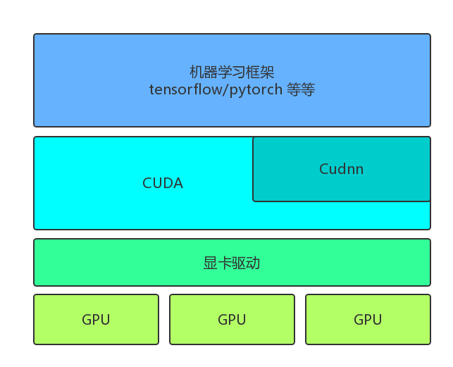
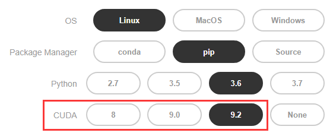
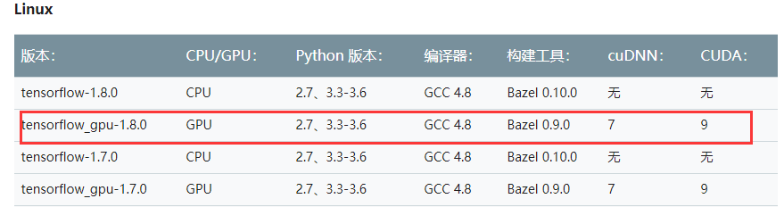

# 了解相关软件

### 相关软件

要在带有GPU的服务器上跑机器学习程序，需要以下4个软件支持  
- 显卡驱动  
- CUDA
- cuDNN
- 机器学习框架(可以不用框架写程序，不过用框架会方便很多)  

他们之间的依赖关系如下图所示

   

首先，软件都需要通过**显卡驱动程序**操作GPU  
其上层的**CUDA**(Compute Unified Device Architecture)是NVIDIA为自家显卡提供的计算库，为更上层的软件提供执行并行计算的接口.比如借助CUDA，你可以用C++很方便的执行矩阵操作之类的运算  

**cuDNN** 由是NVIDIA官方人员编写的专门用于加速神经网络的程序库，提供了各类高度优化的神经网络模型接口，调用Cudnn的接口训练RNN/CNN等网络，会比自己写快很多  

**机器学习框架** 让我们可以用Python等语言编写机器学习程序，在使用GPU加速计算过程时需要上面两个软件的支持

### 选择版本
CUDA和cuDNN有不同版本，我们需要跟剧使用的机器学习框架选择版本  
这里以pytorch和tensorflow为例，分别说明:  
首先是**Pytorch**  
在[Pytorch官网](https://pytorch.org/)的下载界面，你可以看到如下图的提示

  

最后一行是CUDA版本的选择，需要跟服务器的CUDA版本一致
请询问学长/学姐服务器的CUDA版本，选择匹配的下载即可，如果服务器还没有安装CUDA，那就选一个最新版本的

**Tensorflow** 的要求在[这个链接](https://tensorflow.google.cn/install/install_sources#tested_source_configurations)，不像Pytorch提供了多种选择，每种Tensorflow版本只提供一种编译好的版本

我们以Tensorflow-gpu-1.8为例，根据表，我们需要安装CUDA-9.0版本和cuDNN-7.1版本
